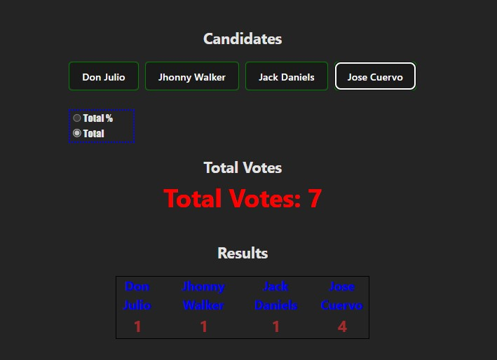

# Make It Real - All About Context

## Project Overview

This project consists of a voting system where users can vote for one of four available candidates. The application allows users to view both the total votes and individual results in numeric or percentage format, as well as offering filters to select which candidates to display.

## Screenshot

## Our Process

### Built With

- **HTML**: Semantic markup created using Visual Studio Code.
- **React**: Developed using Vite in VS Code.
- **CSS**: Styled with a dedicated stylesheet.
- **React Router**: For navigation and routing.
- **React Context**: To manage global state.

## What I Learned

Throughout this project, I gained practical experience with:

- HTML
- CSS
- React
- React Context API

## Author

Victor Ramirez
